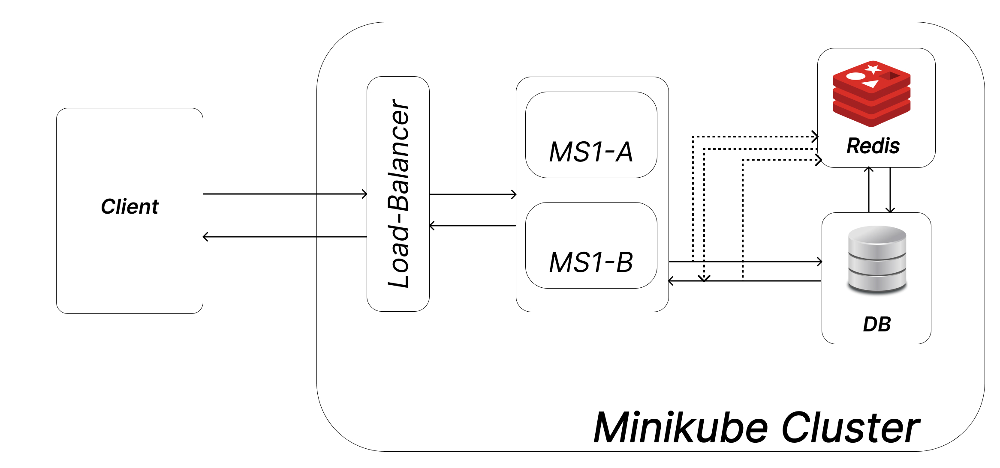

# tech-case-study-3-teamE
This repository is for Team E's case study 3 for the course "Distributed Cache Implementation" of 2023's KPL -  Technology Case studies.

## Architecture

## How to run
1. Clone the repository

## How to deploy

## How to test

## Team Members
